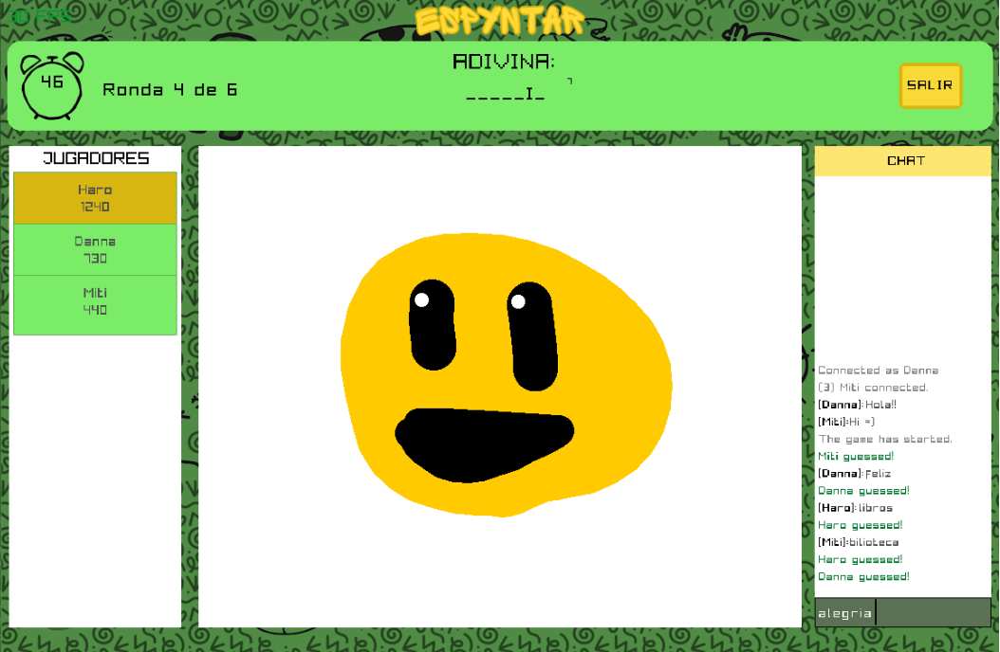

  

---

Espyntar es un juego multijugador por rondas. En cada ronda, un jugador elige una palabra entre tres opciones y la dibuja para que los demás jugadores intenten adivinarla. Los jugadores ganan puntos al adivinar correctamente. Al final del juego, el jugador con más puntos gana. El juego está desarrollado en C++ utilizando Raylib y Raygui para gráficos y la librería de sockets de Windows para la comunicación en red.

## Componentes Principales

### Interfaz Gráfica de Usuario (GUI)

- **Painter**: Permite a los usuarios dibujar en un lienzo, seleccionar colores y dibujar líneas. Utiliza un `Canvas` para el área de dibujo y una `ColorPalette` para los colores disponibles.
- **Canvas**: Representa el lienzo donde se realiza el dibujo. Proporciona métodos para dibujar y gestionar el contenido del lienzo.

### Manejo de Juegos

- **Game**: Representa una partida, maneja las rondas del juego y la administración de jugadores.
- **Round**: Maneja las rondas individuales dentro de una partida, incluyendo la gestión de palabras y la coordinación entre dibujante y adivinadores.

### Conectividad de Red

- **Client**: Representa un cliente que puede conectarse y desconectarse de un servidor. Maneja el estado de la conexión, y tiene un ID y nombre para identificarse. Las funciones `Send` y `Receive` se ejecutan en hilos separados para mantener la comunicación en tiempo real.
- **Server**: Maneja la funcionalidad del servidor, incluyendo la aceptación de conexiones y la gestión de la lógica del juego.

### Componentes Auxiliares

- **ColorPalette**: Gestiona una paleta de colores disponibles para el juego.
- **Screen**: Maneja las pantallas del juego, incluyendo la escena actual y los elementos gráficos asociados.
- **OtherClient**: Representa a otros clientes en el juego, almacenando información básica como su ID, nombre y puntos.
- **PaintMessage**: Encapsula la información necesaria para representar un mensaje de pintura en el juego.

## Uso de Bibliotecas

### Raylib
Raylib es una librería de gráficos que permite crear interfaces visuales de manera sencilla y eficiente. En Espyntar, Raylib se utiliza para renderizar la interfaz gráfica del juego.

### Raygui
Raygui es una extensión de Raylib que proporciona herramientas para crear interfaces gráficas de usuario (GUI). Espyntar utiliza Raygui para manejar los elementos interactivos del juego.

### WinSock2
WinSock2 es una librería de sockets para Windows que facilita la comunicación en red. En Espyntar, WinSock2 se utiliza para gestionar las conexiones entre el servidor y los clientes del juego.

## Instrucciones de Compilación

El código fuente del proyecto se puede encontrar en el siguiente enlace: [https://github.com/Scalaptia/espyntar](https://github.com/Scalaptia/espyntar). Para compilarlo, necesitamos:

- Un compilador de C++ (MinGW-w64)
- CMake
- Windows 10 u 11

### Compilación del Servidor

Ejecutar el comando `make` en la raíz del proyecto (`/espyntar/EspyntarServer.exe`). Esto creará un ejecutable llamado `EspyntarServer.exe`, que mostrará la dirección IP y el puerto al cual conectarse desde el cliente.

### Compilación del Cliente

1. Seleccionar el kit gcc desde la paleta de comandos en Visual Studio Code.
2. Compilar el proyecto utilizando el botón de "play" en la barra inferior del IDE.
3. El ejecutable resultante se encontrará en el directorio `build` del proyecto (`/espyntar/build/Espyntar.exe`).

Para tener más clientes de manera local, podemos simplemente ejecutar múltiples veces el archivo `Espyntar.exe` desde el explorador de archivos.

## Pantallas del Juego

